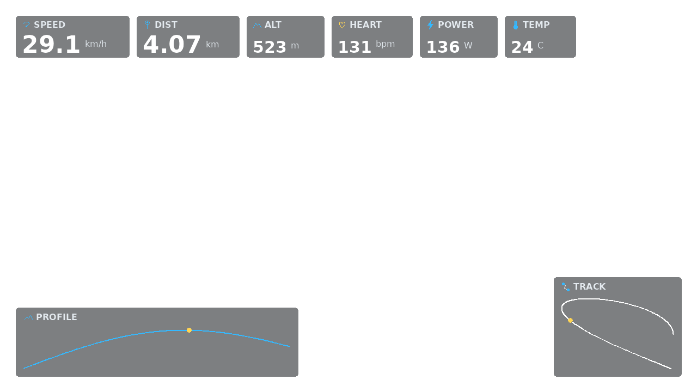

# Garmin Video Overlay

Render Garmin FIT telemetry as a transparent video overlay for cycling videos.
The output can be placed over an action-camera clip in DaVinci Resolve or used
to create a quick burned-in preview video.



The project is intentionally small: it reads FIT record messages, interpolates
telemetry to the video frame rate, draws a compact overlay, and exports ProRes
4444, PNG frames, or preview MP4s through `ffmpeg`.

## Features

- Parse Garmin `.fit` activity files with `fitdecode`
- Normalize FIT timestamps to UTC-relative elapsed time
- Interpolate telemetry to a fixed FPS timeline
- Apply manual sync offsets and time-scale factors for timelapse footage
- Draw speed, distance, altitude, heart rate, power, temperature, elevation
  profile, and a simple track map when the FIT data contains those fields
- Export a transparent ProRes 4444 `.mov`
- Fall back to a transparent PNG sequence when `ffmpeg` is unavailable
- Render fast preview MP4 files with either CPU x264 or NVIDIA NVENC
- Optionally composite the overlay directly onto a source video

## Requirements

- Python 3.10 or newer
- Python packages from `requirements.txt`
- Optional but recommended: `ffmpeg` and `ffprobe`

`ffmpeg` is required for ProRes, video probing, and composite preview exports.
Without it, the overlay renderer can still write a PNG sequence.

## Installation

```bash
git clone https://github.com/vibecodingwean/garmin-video-overlay.git
cd garmin-video-overlay
python3 -m venv .venv
. .venv/bin/activate
pip install -r requirements.txt
```

On Windows PowerShell:

```powershell
python -m venv .venv
.\.venv\Scripts\Activate.ps1
pip install -r requirements.txt
```

## Quick Start

If your source video can be probed by `ffprobe`, render a transparent overlay
that matches the video duration, resolution, and frame rate:

```bash
python garmin_overlay.py \
  --fit ride.fit \
  --video input.mp4 \
  --output overlay.mov
```

If you want to provide the video settings manually:

```bash
python garmin_overlay.py \
  --fit ride.fit \
  --output overlay.mov \
  --duration 1800 \
  --width 3840 \
  --height 2160 \
  --fps 30
```

Export a PNG sequence instead of ProRes:

```bash
python garmin_overlay.py \
  --fit ride.fit \
  --video input.mp4 \
  --output overlay_frames \
  --format png
```

Write a CSV next to a short render to inspect the parsed FIT values:

```bash
python garmin_overlay.py \
  --fit ride.fit \
  --output check_frames \
  --duration 30 \
  --width 1280 \
  --height 720 \
  --fps 30 \
  --csv ride_check.csv \
  --format png
```

## Linux Convenience Wrapper

`render_garmin_clip.sh` creates a burned-in MP4 preview or finished social clip.
It calculates `--time-scale` from the FIT duration and video duration by
default, which is useful for timelapse action-camera footage.

```bash
./render_garmin_clip.sh \
  --video input.mp4 \
  --fit ride.fit \
  --output output_with_overlay.mp4
```

Render a short preview from the middle of the source video before starting a
long export:

```bash
./render_garmin_clip.sh \
  --video input.mp4 \
  --fit ride.fit \
  --preview 5 \
  --output preview_5s.mp4
```

## Sync and Timelapse

`--offset` shifts telemetry relative to the video in video seconds:

- `--offset 3.2` means telemetry starts 3.2 seconds after the video.
- `--offset -5` means telemetry started 5 seconds before the video.

`--time-scale` maps video time to FIT time. A normal video uses `1`. A video
played back at 10x speed uses `10`, meaning one video second equals ten FIT
seconds.

```bash
python garmin_overlay.py \
  --fit ride.fit \
  --video input.mp4 \
  --output overlay.mov \
  --time-scale 10 \
  --offset 0.5
```

Practical sync workflow:

1. Find a visible event in the video, such as a start, stop, turn, bridge, or
   short sprint.
2. Render a short preview.
3. Compare the visual event with speed, power, or track movement.
4. Increase `--offset` if telemetry appears too early.
5. Decrease `--offset` if telemetry appears too late.

## Preview and Composite Formats

Transparent exports for editing:

```bash
python garmin_overlay.py --fit ride.fit --video input.mp4 --output overlay.mov --format prores
python garmin_overlay.py --fit ride.fit --video input.mp4 --output overlay_frames --format png
```

Fast preview exports without alpha:

```bash
python garmin_overlay.py \
  --fit ride.fit \
  --video input.mp4 \
  --output preview.mp4 \
  --format composite-x264
```

For NVIDIA systems with NVENC:

```bash
python garmin_overlay.py \
  --fit ride.fit \
  --video input.mp4 \
  --output preview.mp4 \
  --format composite-nvenc
```

Preview and composite MP4 outputs do not preserve transparency. Use ProRes
4444 or PNG frames for a final DaVinci Resolve overlay.

## DaVinci Resolve Workflow

1. Export the activity `.fit` file from Garmin Connect or your device.
2. Render `overlay.mov` with the default ProRes 4444 output.
3. Import your source video and `overlay.mov` into Resolve.
4. Place `overlay.mov` on a video track above the source video.
5. Check alpha interpretation if Resolve does not detect transparency.
6. Fine-tune `--offset` and render again if timing is off.
7. If ProRes alpha causes problems, render `--format png` and import the PNG
   sequence instead.

## Configuration

Widget positions and theme values can be overridden with JSON. See
[`examples/example_config.json`](examples/example_config.json).

```bash
python garmin_overlay.py \
  --fit ride.fit \
  --video input.mp4 \
  --output overlay.mov \
  --config examples/example_config.json
```

Disable optional widgets:

```bash
python garmin_overlay.py \
  --fit ride.fit \
  --video input.mp4 \
  --output overlay.mov \
  --no-track \
  --no-profile
```

## Example Image

The example uses generated telemetry and a fictional route. No recorded ride,
GPS track, source video or audio is included. Regenerate it with:

```bash
python examples/generate_example_image.py
```

## Project Structure

```text
garmin-video-overlay/
  README.md
  requirements.txt
  garmin_overlay.py
  render_garmin_clip.sh
  overlay/
    config.py
    fit_loader.py
    interpolate.py
    render.py
    widgets.py
  examples/
    example_config.json
    generate_example_image.py
    example-overlay.png
```

## Limitations

- FIT speed is interpreted as meters per second and displayed as km/h.
- FIT distance and altitude are interpreted as meters.
- FIT timestamps are treated as UTC when exposed as naive datetimes.
- The track widget is a simple 2D projection for small route previews, not a
  map projection.
- NVENC and x264 outputs are preview/composite paths and do not preserve alpha.
